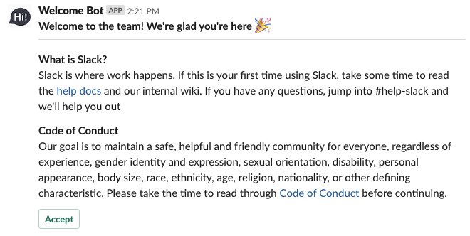

# Sending a Welcome Message to a New User 

> :sparkles: *Updated December 2019: As we have introduced some new features, this tutorial and the code samples have been updated! All the changes from the previous version of this example, read the [DIFF.md](DIFF.md)*

Sample Slack app that presents a Terms of Service (or any other message) when a new user joins a team.

The user can accept the Terms of Service using message buttons. If a user has been presented with the Terms before and they haven't accepted, a background job can send them a reminder after a specific period of time. If you are on Plus plan or Slack Enterprise Grid, you may use the [SCIM API](https://api.slack.com/scim) to disable the user's account.

## Setup

#### Create a Slack app

1. [Create an app](https://api.slack.com/apps)
2. Go to **Bot Users** and click "Add a Bot User" to create a, app bot. Save the change.
3. Enable Interactive components (See *Enable Interactive Components* below)
4. Navigate to the **OAuth & Permissions** page and add the following bot token scopes:
    * `chat:write`, `im:write`, `users:read`
5. Click 'Save Changes' and install the app (You should get an OAuth access token after the installation)
6. Enable the events (See *Enable the Events API* below. It doesn't let you  the Request URL until you run the code!)
7. In your Slack workspace, invite the bot to #general, where the new user will join.

#### Run locally or 
1. Get the code
    * Either clone this repo and run `npm install`
    * Or visit https://glitch.com/edit/#!/remix/slack-terms-of-service-blueprint
2. Set the following environment variables to `.env` (see `.env.sample`):
    * `SLACK_ACCESS_TOKEN`: Your app's `xoxb-` token (available on the Install App page, after you install the app to a workspace once.)
    * `SLACK_SIGNING_SECRET`: Your app's Signing Secret (available on the **Basic Information** page)
3. If you're running the app locally:
    * Start the app (`npm start`)

#### Enable the Events API
1. Go back to the app settings and click on Events Subscriptions
1. Set the Request URL to your server (*e.g.* `https://yourname.ngrok.com`) or Glitch URL + `/events`
1. On the same page, subscribe to the `team_join` team events

#### Enable Interactive Messages
1. In the app settings, click on Interactive Messages
1. Set the Request URL to your server or Glitch URL + `/interactive`
